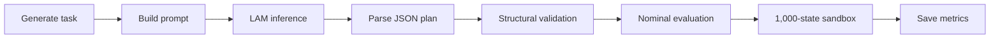

# LAM-Only Network-Management Evaluation Prototype

This repository contains the **LAM-only baseline prototype** used in the
architectural evaluation of Octopus. Every network-management request is sent
directly to a remote Large AI Model (LAM), and the generated plan is evaluated
by a deterministic Digital Twin (DT) sandbox. Sandbox feedback is used only for
evaluation and is **not** returned to the LAM for refinement.

The prototype evaluates whether a LAM can generate structurally valid, robust,
and policy-compliant traffic-management plans under short-term link-load
uncertainty.

> **Scope.** The supplied script implements the LAM-only baseline. It does not
> implement the DT-only controller or the complete Octopus feedback-refinement
> workflow. Those components must be released separately before this repository
> can be described as the complete three-architecture testbed.

## Main Features

- Real streaming LAM inference through an OpenAI-compatible API.
- DeepSeek thinking mode disabled for the baseline experiment.
- Exact mixed workload composition:
  - 60% routine single-link congestion tasks;
  - 20% coordinated multi-link congestion tasks;
  - 20% policy-constrained semantic tasks.
- Four-link network with a capacity of 100 Mbps per link.
- Structural validation of every generated action plan.
- Monte Carlo sandbox verification over 1,000 perturbed network states.
- Separate measurements of:
  - time to first token (TTFT);
  - LAM inference latency;
  - sandbox-verification latency;
  - end-to-end service latency.
- Detailed per-task results and architecture-level summary statistics in CSV
  format.

## Evaluation Workflow



For each request, the LAM receives the reported link capacities, loads,
migration budget, action limit, forbidden targets, overload threshold, and
uncertainty model. The hidden task-category label and diagnostic feasibility
fields are deliberately excluded from the prompt.

The expected response is JSON only:

```json
{
  "actions": [
    {
      "action": "reroute",
      "from_link": "L1",
      "to_link": "L3",
      "traffic": 12.5
    }
  ]
}
```

## Experimental Parameters

| Parameter | Default | Description |
| --- | ---: | --- |
| `NUM_TASKS` | 20 | Number of generated requests |
| `RANDOM_SEED` | 2026 | Deterministic workload seed |
| Routine/multi-link/policy ratio | 60/20/20 | Mixed workload composition |
| Link count | 4 | Links `L1`--`L4` |
| Link capacity | 100 Mbps | Capacity of every link |
| `OVERLOAD_THRESHOLD` | 0.90 | Maximum allowed utilization |
| `LOAD_PERTURBATION` | ±5% | Independent load uncertainty |
| `SANDBOX_SCENARIOS` | 1,000 | Perturbed states per plan |
| `ROBUST_PASS_RATIO` | 0.95 | Required sandbox success ratio |
| `SAFETY_MARGIN_MBPS` | 0.50 Mbps | Preferred safety margin |
| `MAX_API_RETRIES` | 3 | Maximum API attempts per request |
| `RETRY_INTERVAL_SECONDS` | 2 s | Delay between failed attempts |

The default 20-task run generates 12 routine, 4 multi-link, and 4
policy-constrained requests. Set `NUM_TASKS = 100` to reproduce the
60/20/20-request workload described in the paper.

## Requirements

- Python 3.9 or newer
- `openai` Python package with support for streaming chat completions
- Access to an OpenAI-compatible DeepSeek endpoint

Install the dependency with:

```bash
python -m pip install --upgrade openai
```

## Security: Remove the Embedded API Key

**Do not publish or run the supplied source file with its current embedded API
key.** Revoke or rotate that key before creating a public repository, even if
the repository has not yet been published.

Replace the client configuration with an environment-variable-based version:

```python
import os

from openai import OpenAI

client = OpenAI(
    api_key=os.environ["DEEPSEEK_API_KEY"],
    base_url="https://api.deepseek.com",
)
```

Set the key before running the experiment.

Linux/macOS:

```bash
export DEEPSEEK_API_KEY="your-api-key"
```

Windows PowerShell:

```powershell
$env:DEEPSEEK_API_KEY="your-api-key"
```

Never commit `.env` files, credentials, raw authorization headers, or private
endpoint information. A suitable `.gitignore` entry is:

```gitignore
.env
.env.*
*.key
```

## Running the Experiment

Rename the supplied script to a descriptive filename, for example:

```text
lam_only_mixed_tasks_revised.py
```

Then run:

```bash
python lam_only_mixed_tasks_revised.py
```

The script has no command-line parameter interface. Change experiment settings
in the parameter section near the top of the source file.

Before a full experiment, a short test is recommended:

```python
NUM_TASKS = 2
PRINT_PROMPT = False
```

After confirming API access and output parsing, restore the intended task count.

## Model Configuration

The model is selected by:

```python
MODEL_NAME = "deepseek-v4-flash"
```

Change this value only to a model name supported by the configured endpoint.
The implementation disables thinking mode through:

```python
extra_body={
    "thinking": {
        "type": "disabled"
    }
}
```

If a paper or report names a different model variant, update either the code or
the manuscript so that the reported configuration matches the released
implementation.

## Generated Workload

### Routine single-link tasks

One link is overloaded and the request permits one rerouting action. At least
one robust target link is available.

### Coordinated multi-link tasks

Two links are overloaded simultaneously. A feasible solution requires two
coordinated rerouting actions.

### Policy-constrained tasks

One link is overloaded, but the least-loaded target is explicitly forbidden.
The LAM must identify another feasible target while satisfying the semantic
policy constraint.

The task type is retained for evaluation and reporting but is never included in
the LAM prompt.

## Sandbox Verification

The evaluator first checks whether the plan:

- contains at least one supported `reroute` action;
- uses known and distinct source and target links;
- respects the maximum number of actions;
- respects the total migration budget;
- avoids forbidden target links;
- uses positive traffic values; and
- does not move more traffic than the source link contains.

A structurally valid plan is then evaluated on the nominal network state and
1,000 independently perturbed states. In every sandbox state, each reported
link load is multiplied by a value sampled uniformly from `[0.95, 1.05]`. A
plan is considered robust when it succeeds in at least 95% of these states.

Sandbox sampling is deterministic for a fixed task identifier, which makes
verification repeatable for the same generated workload.

## Output Files

The experiment writes two files in the current working directory.

### `lam_only_mixed_detailed_results.csv`

Contains one row per request, including:

- task identifier, type, and complexity;
- LAM inference latency, verification latency, service latency, and TTFT;
- API and parsing status;
- structural, nominal, and robust evaluation results;
- utilization and overloaded-link reductions;
- sandbox pass ratio;
- action count and migrated traffic;
- LAM invocation and call counts;
- parsed action plan, raw LAM output, and error message.

### `lam_only_mixed_summary.csv`

Contains the five architecture-level metrics used by the script:

| Metric | Definition |
| --- | --- |
| Average Latency | Mean end-to-end service latency over all requests |
| Task Success Rate | Percentage of requests producing structurally valid plans that solve the nominal state |
| Successful-Strategy Robustness | Mean sandbox pass ratio over nominally successful plans only |
| Avg. Max-Util. Reduction | Mean reduction in maximum link utilization, in percentage points |
| LAM Invocation Ratio | Percentage of requests sent to the LAM; 100% for LAM-only |

The current `Task Success Rate` is based on nominal success, whereas robustness
is reported separately. Do not describe this column as the robust deployable
success rate unless the summary implementation is changed accordingly.

## Reproducibility Notes

- Workload generation is deterministic under `RANDOM_SEED`.
- Sandbox perturbations are deterministic for each task identifier.
- Remote LAM latency can vary because of network conditions, provider load,
  batching, and service-side scheduling.
- `temperature=0` reduces sampling variability but does not guarantee identical
  outputs from a hosted model.
- API retries and retry waiting time are included in the measured end-to-end
  service latency.
- Set `PRINT_PROMPT = False` for large experiments to reduce console output.
- The detailed CSV stores raw LAM responses. Review those outputs before making
  experiment artifacts public.

For a fair comparison with DT-only and Octopus, all implementations should use
the same generated task list, sandbox parameters, random seed, model endpoint,
and metric definitions.

## Known Limitations

- The test network contains four abstract links rather than a packet-level
  network emulator.
- The LAM is accessed through an external hosted service, so latency is not
  fully controlled by the experimenter.
- The current LAM-only prototype performs one LAM call per request and does not
  use sandbox feedback for refinement.
- The task generator guarantees the existence of a feasible plan; it does not
  represent every possible operational network condition.
- API pricing, rate limits, and model availability depend on the service
  provider.

## Suggested Repository Layout

```text
.
├── README.md
├── lam_only_mixed_tasks_revised.py
├── requirements.txt
└── results/                  # Optional; generated CSV files
```

A minimal `requirements.txt` is:

```text
openai>=1.0.0
```

## Citation

If you use this prototype, please cite the associated Octopus paper. The final
BibTeX entry should be added here after publication or public preprint release.

## License

Add an explicit open-source license before publishing the repository. Do not
assume that code is reusable merely because it is publicly accessible.

