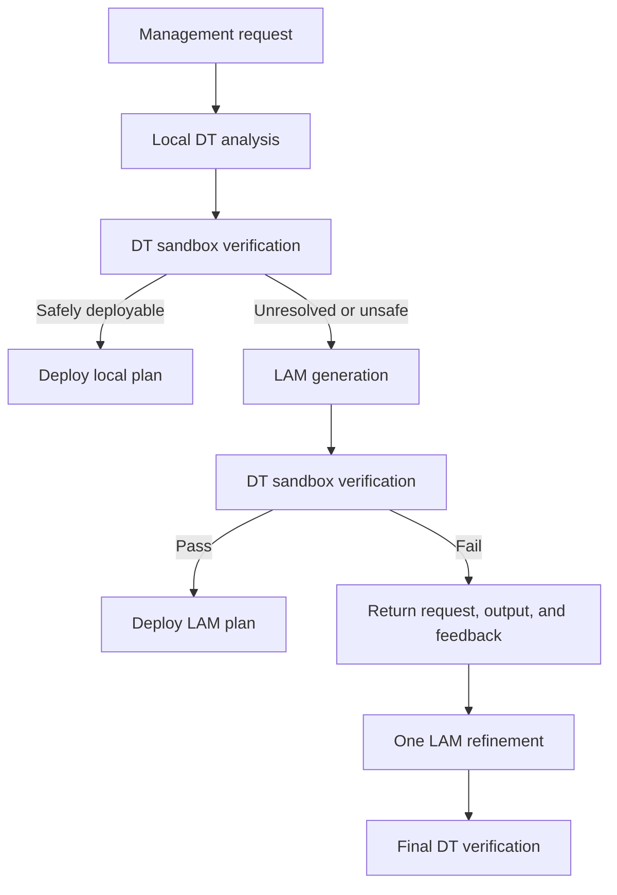

# Octopus Three-Architecture Evaluation Testbed

This repository provides the prototype used to compare three network-management
architectures under identical workloads and verification conditions:

1. **DT-only** -- requests are handled exclusively by a lightweight local
   Digital Twin (DT) controller.
2. **LAM-only** -- every request is sent directly to a Large AI Model (LAM), and
   DT sandbox feedback is used only for offline evaluation.
3. **Octopus** -- the local DT handles routine requests first, unresolved or
   unsafe requests are escalated to the LAM, and every LAM-generated plan is
   verified before deployment. A rejected first-round plan may be refined once
   using detailed DT feedback.

The testbed evaluates the architectural benefit of combining low-latency edge
autonomy, global LAM reasoning, and verification-driven feedback.

> **Scope:** This is an application-level network-management prototype. It
> models link states, management actions, short-term uncertainty, and sandbox
> verification; it is not a packet-level network emulator or an NS-3 model.

## Architecture Comparison

| Architecture | Initial processor | DT verification | Feedback returned to LAM | Maximum refinement rounds |
| --- | --- | --- | --- | ---: |
| DT-only | Local DT | Yes | Not applicable | 0 |
| LAM-only | LAM | Offline evaluation only | No | 0 |
| Octopus | Local DT, then selective LAM escalation | Yes, before deployment | Yes | 1 |

The three architectures receive the same generated task list and are evaluated
using the same structural checks, perturbed network states, and deployability
criterion.

## Octopus Workflow



For the second Octopus LAM round, the prompt contains the complete previous
prompt, the complete raw LAM output, and detailed DT rejection feedback. This
makes the refinement process auditable and prevents the feedback loop from
being reduced to a generic retry.

## Experimental Setup

The runtime configuration in the supplied script is:

| Parameter | Default value |
| --- | ---: |
| Number of requests | 100 |
| Routine single-link requests | 60% |
| Coordinated multi-link requests | 20% |
| Policy-constrained requests | 20% |
| Links | `L1`, `L2`, `L3`, `L4` |
| Capacity per link | 100 Mbps |
| Overload threshold | 90% |
| Independent load perturbation | +/-5% |
| Sandbox states per candidate | 1,000 |
| Safe-deployment threshold | 95% pass rate |
| Safety margin | 0.5 Mbps |
| Maximum Octopus LAM rounds | 2 |
| Random seed | 2026 |
| LAM temperature | 0 |
| Thinking mode | Disabled |

The artificial task-type label is retained only for result grouping. It is not
provided to either the DT controller or the LAM.

## Task Types

- **Routine:** a single overloaded link that can generally be handled through
  one local rerouting action.
- **Multi-link:** multiple overloaded links or a request requiring coordinated
  actions.
- **Policy-constrained:** a semantic management request containing constraints
  such as forbidden target links.

Each task specifies link capacities and loads, a traffic-migration budget, a
maximum number of actions, and any relevant policy constraint.

## Plan Format

The LAM is instructed to return a JSON management plan. A typical plan is:

```json
{
  "actions": [
    {
      "action": "reroute",
      "from_link": "L1",
      "to_link": "L3",
      "traffic": 12.5
    }
  ]
}
```

Before simulation, the evaluator checks the action type, link identifiers,
source-target distinction, positive traffic volume, traffic budget, action
limit, source availability, target capacity, and policy constraints.

## Requirements

- Python 3.9 or later
- `openai` Python package
- Access to an OpenAI-compatible DeepSeek API endpoint

Install the dependency with:

```bash
python -m pip install --upgrade openai
```

No external dataset is required because the network-management requests are
generated by the script.

## API Configuration

Do not commit an API key to the repository. Read it from an environment
variable instead:

```python
import os
from openai import OpenAI

client = OpenAI(
    api_key=os.environ["DEEPSEEK_API_KEY"],
    base_url="https://api.deepseek.com",
)
```

Set the variable before running the experiment.

Linux/macOS:

```bash
export DEEPSEEK_API_KEY="your-api-key"
```

Windows PowerShell:

```powershell
$env:DEEPSEEK_API_KEY="your-api-key"
```

The supplied implementation uses an OpenAI-compatible streaming chat API and
disables thinking mode through `extra_body`. Confirm that `MODEL_NAME` is
valid for your endpoint before running the full experiment.

## Running the Experiment

Save the supplied Python code as `octopus_evaluation.py`. If it was copied
from a Markdown attachment, remove the outer backtick fences first. Then run:

```bash
python octopus_evaluation.py
```

The script executes the architectures sequentially in this order:

1. DT-only;
2. LAM-only;
3. Octopus.

With the default configuration, LAM-only submits at least 100 logical LAM
requests, and Octopus may submit additional requests for escalated tasks.
Runtime and API cost therefore depend on endpoint load, retry behavior, and the
number of Octopus escalations.

For a low-cost smoke test, temporarily reduce `NUM_TASKS` and
`SANDBOX_SCENARIOS`. Such results should not be reported as the full
experiment.

## Output Files

The script writes two UTF-8 CSV files in the current working directory.

### `three_architecture_detailed_results.csv`

Contains one row per architecture-task pair. Important fields include:

| Field | Meaning |
| --- | --- |
| `architecture` | `DT-only`, `LAM-only`, or `Octopus` |
| `task_id`, `task_type` | Task identifier and evaluation category |
| `processing_path` | `DT-local`, `LAM-direct`, or `LAM-escalation` |
| `service_latency_ms` | End-to-end processing time measured by the prototype |
| `ttft_ms` | Time to first token; accumulated across Octopus LAM rounds |
| `task_success` | Whether the final plan is structurally valid and robust |
| `deployed` | Whether the plan is considered safely deployable |
| `sandbox_pass_ratio` | Fraction of perturbed states passed |
| `max_utilization_reduction_pp` | Maximum-utilization reduction in percentage points |
| `lam_invoked` | Whether the request used the LAM |
| `lam_calls` | Number of actual API accesses, including retries |
| `final_plan` | Final parsed management plan |
| `feedback` | DT/evaluator result for the final candidate |
| `raw_lam_output` | Raw output or complete Octopus interaction trace |
| `error_message` | API or parsing errors, if present |

### `three_architecture_summary.csv`

Reports five architecture-level metrics:

- average service latency;
- deployable success rate;
- successful-strategy robustness;
- average maximum-utilization reduction;
- total number of actual LAM/API calls.

## Metric Definitions

### Deployable Success Rate

A plan is successful only if it is structurally valid and succeeds in at least
95% of the 1,000 perturbed states. The same definition is used for all three
architectures.

### Successful-Strategy Robustness

The average sandbox pass ratio is computed only over safely deployable plans.

### Maximum-Utilization Reduction

Physical-network improvement is counted only for plans that pass verification
and are deployed. Rejected candidates contribute zero improvement.

### Total LAM Calls

This metric counts every execution of the remote chat-completion API. A
two-round Octopus interaction contributes two calls, while failed requests and
their API retries contribute additional calls. It is therefore different from
the binary `lam_invoked` field.

## Reproducibility and Fairness

- `RANDOM_SEED=2026` fixes common task generation.
- The same task objects are reused by all three architectures.
- All candidates use the same structural validator and robust sandbox.
- Perturbation sequences are deterministically derived from the common seed and
  task identity.
- Rejected plans contribute zero physical-network improvement for every
  architecture.
- The task-type label is hidden from both decision makers.
- LAM-only does not receive evaluator feedback, whereas Octopus receives it only
  after a failed verified candidate.

Because remote inference latency can vary with provider load, serious latency
comparisons should be repeated at different times or over multiple runs. Keep
the model, endpoint, temperature, thinking-mode setting, and retry policy fixed
across compared methods.

## Suggested Repository Layout

```text
.
|-- octopus_evaluation.py
|-- README.md
|-- results/                         # optional, generated files
|   |-- three_architecture_detailed_results.csv
|   `-- three_architecture_summary.csv
`-- LICENSE
```

## Release Checklist

Before publishing the repository:

1. Revoke any API key that has ever appeared in the source code or shared
   attachments.
2. Replace the hard-coded key with `DEEPSEEK_API_KEY`.
3. Remove the outer Markdown code fences from the Python file.
4. Make the introductory comments agree with the runtime constants: the current
   experiment uses 100 requests, not 20.
5. Make the documented LAM name agree with `MODEL_NAME`; do not describe the
   experiment as using a Flash model while the code selects a Pro model.
6. Inspect detailed CSV files before release because they may contain complete
   prompts, model outputs, policies, and verification feedback.
7. Add an explicit open-source license.

## Limitations

- The prototype models a four-link management problem rather than a complete
  production network.
- LAM latency is measured through a remote endpoint and includes external
  service variability.
- DT logic is rule based and intentionally limited to routine local cases.
- Monte Carlo robustness does not constitute a formal safety guarantee.
- Results depend on the selected LAM, API version, prompt, and provider-side
  serving configuration.

## Citation

If this testbed contributes to an academic publication, please cite the
corresponding Octopus/GAMMA paper. Replace this section with the final BibTeX
entry once the paper metadata is available.

## License

No license is implied by source availability. Add a `LICENSE` file before
public release; MIT or Apache-2.0 are common choices for research prototypes.
